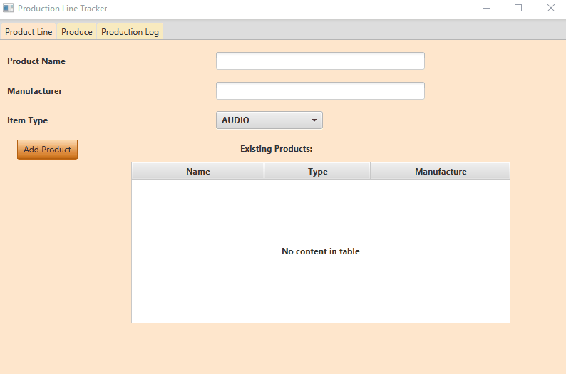
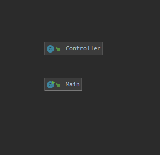
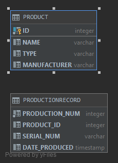
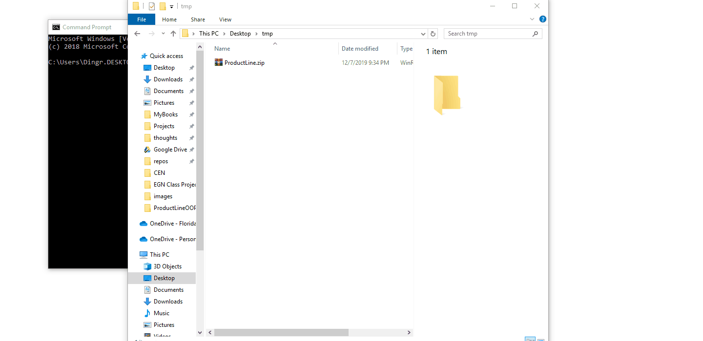

# ProductLineOOPFXDB
This program allows a manufacturer to easily record log their production runs complete with generated timestamps and serial numbers for each item produced.
## Demonstration

## Documentation
[Java-Docs](https://dingram91.github.io/ProductLineOOPFXDB/)
## Diagrams
### Class Digram

### Database Diagram

## Getting Started

### How to Install
1. Download the program from the release tab.
2. Extract the jar and res folder to a location on your computer.
3. Open a command prompt
4. enter command "cd path/to/folder/containing/jar"
5. enter command "java -jar ProductLineOOPFXDB.jar"

### Using the Application
##### To add a new product:  
  Enter information for a producible product under the Product Line tab.  
##### To record a production run:  
  Select a product and quantity in the Produce tab and click "Record Production".  
##### To view a log of production runs:  
  Navigate to the Production Log tab.  

## Built With
Java, JavaFX, H2-Database

## Author
Dylan Ingram
## License
MIT License

Copyright (c) 2019 Dylan Ingram

Permission is hereby granted, free of charge, to any person obtaining a copy of this software and associated documentation files (the "Software"), to deal in the Software without restriction, including without limitation the rights to use, copy, modify, merge, publish, distribute, sublicense, and/or sell copies of the Software, and to permit persons to whom the Software is furnished to do so, subject to the following conditions:

The above copyright notice and this permission notice shall be included in all copies or substantial portions of the Software.

THE SOFTWARE IS PROVIDED "AS IS", WITHOUT WARRANTY OF ANY KIND, EXPRESS OR IMPLIED, INCLUDING BUT NOT LIMITED TO THE WARRANTIES OF MERCHANTABILITY, FITNESS FOR A PARTICULAR PURPOSE AND NONINFRINGEMENT. IN NO EVENT SHALL THE AUTHORS OR COPYRIGHT HOLDERS BE LIABLE FOR ANY CLAIM, DAMAGES OR OTHER LIABILITY, WHETHER IN AN ACTION OF CONTRACT, TORT OR OTHERWISE, ARISING FROM, OUT OF OR IN CONNECTION WITH THE SOFTWARE OR THE USE OR OTHER DEALINGS IN THE SOFTWARE.

## Key Programming Concepts Utilized
GUI programming with JavaFX  
Database programming with the H2 embeded database  
Regex use for error checking  
