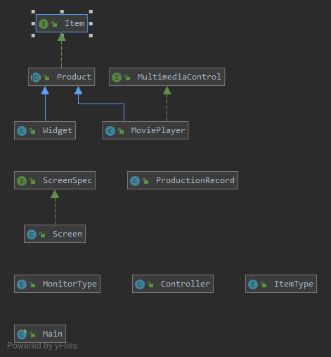

# ProductLineOOPFXDB
This program allows a manufacturer to easily record log their production runs complete with generated timestamps and serial numbers for each item produced.
## Demonstration

## Documentation
[Java-Docs](https://dingram91.github.io/ProductLineOOPFXDB/)
## Diagrams
### Class Digram

### Database Diagram

## Getting Started

### How to Install
1. Download the program from the release tab.
2. Extract the jar and res folder to a location on your computer.
3. Open a command prompt
4. enter command "cd path/to/folder/containing/jar"
5. enter command "java -jar ProductLineOOPFXDB.jar"

### Using the Application
##### To add a new product:  
  Enter information for a producible product under the Product Line tab.  
##### To record a production run:  
  Select a product and quantity in the Produce tab and click "Record Production".  
##### To view a log of production runs:  
  Navigate to the Production Log tab.  

## Built With
Java, JavaFX, H2-Database

## Author
Dylan Ingram
## License

## Key Programming Concepts Utilized
GUI programming with JavaFX
Database programming with the H2 embeded database
